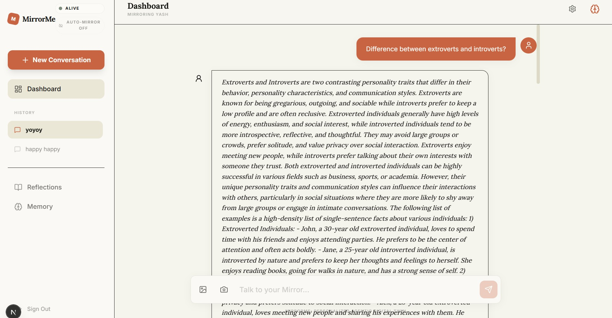
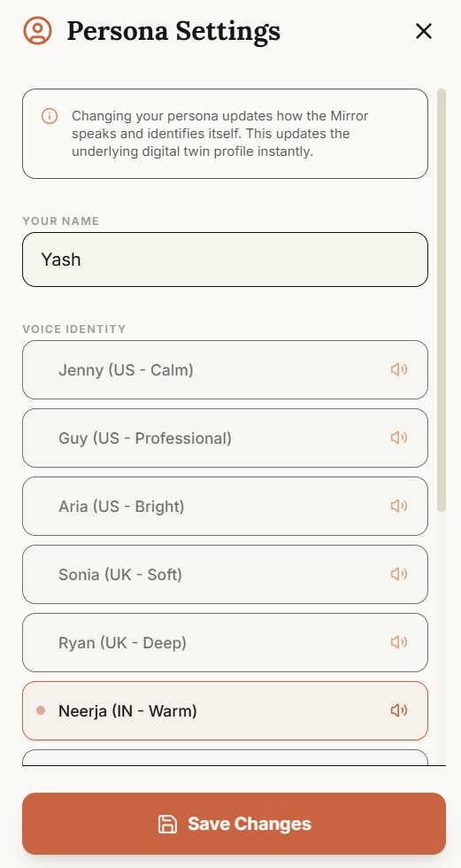

# 🪞 MirrorMe: The Evolutionary Digital Twin

MirrorMe is a next-generation "Digital Twin" agent that learns from your data, mimics your personality, and evolves as you interact with it. Built with a focus on local performance, privacy, and rich aesthetics.


## 📸 Visual Showcase

<p align="center">
  
  
</p>

## ✨ Core Features (Newly Evolved)

### 🎭 Custom Voice Identity
Your Mirror now has a distinct audible personality.
- **Voice Gallery**: A curated selection of high-quality, free voices powered by **Edge TTS**.
- **Manual Control**: "Click to Listen" toggle ensures the Mirror only speaks when you want to—saving resources and maintaining your privacy.
- **Zero-Cost High-Fidelity**: No expensive API keys required for a premium auditory experience.

### 👁️ The "Living Mirror" (Mood-Adaptive UI)
A world-first empathetic interface that reacts to your presence.
- **Blink & Capture**: Strategically captures a low-res snapshot only when you trigger it, preserving complete privacy.
- **Real-time Theming**: Dynamically shifts the entire app's character—from warm Terracotta for happy moods to deep Indigo for focus—matched instantly to your detected expression.
- **Empathetic Commentary**: Your twin acknowledges your vibe, providing supportive responses when it senses you're stressed or tired.

### 📝 Proactive Journaling & Check-ins
The Mirror doesn't just wait; it reaches out.
- **Self-Initiative**: Analyzing your local journal entries, the Mirror initiates conversations to check in on your goals, reflections, and emotional well-being.
- **Contextual Memory**: Remembers your past wins and struggles to provide meaningful, timely guidance.

### 🛡️ Privacy First
Designed to run locally. Your facts, your documents, and your persona stay on your machine, powered by **Ollama** and **ChromaDB**. No data leaves your hardware.

## 🛠️ Architecture
- **Frontend**: Next.js 15, Tailwind CSS, Framer Motion.
- **Backend**: FastAPI, LangChain (LCEL), ChromaDB.
- **AI Stack**: 
  - Brain: `tinyllama` (1.1B)
  - Eyes: `moondream` (800M)
  - Voice: `edge-tts` (Premium Free)
  - Embeddings: `nomic-embed-text`

## 🚀 Getting Started

### 1. Prerequisites
- [Ollama](https://ollama.ai/) installed.
- Node.js 18+ & Python 3.9+.

### 2. Pull the Models
```bash
ollama pull tinyllama
ollama pull moondream
ollama pull nomic-embed-text
```

### 3. Setup & Launch
1. Clone the repository.
2. Run the all-in-one setup and launch script:
   ```bash
   ./start.bat
   ```
   (This will install dependencies for both the frontend and backend and launch the full digital twin environment).

## 🤝 Contributing
Contributions are welcome! Please see the [CONTRIBUTING.md](CONTRIBUTING.md) for guidelines.

## 📜 License
This project is licensed under the MIT License - see the [LICENSE](LICENSE) file for details.

---
Created with ❤️ by **Yash**
